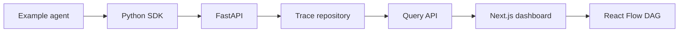

# Architecture overview

## Goal

Prove that No More 500s can ingest observable AI-agent execution events and
reconstruct a useful execution graph before implementing advanced detection or
analytics.

## Initial data path

The repository boundary initially uses memory and is intentionally replaceable.
The ClickHouse schema is included for the next persistence milestone.

## Boundaries

- **SDK:** Creates and exports vendor-neutral trace payloads. It does not know
  about the dashboard or database.
- **API:** Validates payloads and coordinates storage. Routes do not contain
  storage queries.
- **Contracts:** Define stable, language-neutral event shapes.
- **Dashboard:** Reads only the public API and maps spans into nodes and edges.
- **Detectors:** Future services consume stored traces and emit `Failure`
  records; they do not mutate raw telemetry.

## Privacy boundary

The platform records explicit application inputs, outputs, tool activity, and
metadata supplied by the customer. It does not claim to capture or reconstruct
a model provider's private chain-of-thought reasoning.

## Deferred work

- API keys and multi-tenant authorization
- ClickHouse repository implementation and migrations
- Redis until caching or asynchronous ingestion is justified
- OTLP exporter and framework integrations
- Loop, schema mismatch, and tool hallucination detectors
- Cost/latency comparison and regression views
- Production deployment and operational controls

